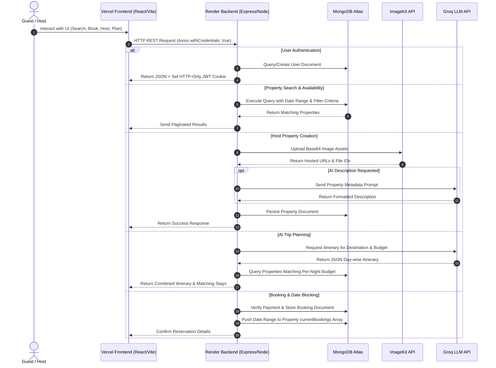
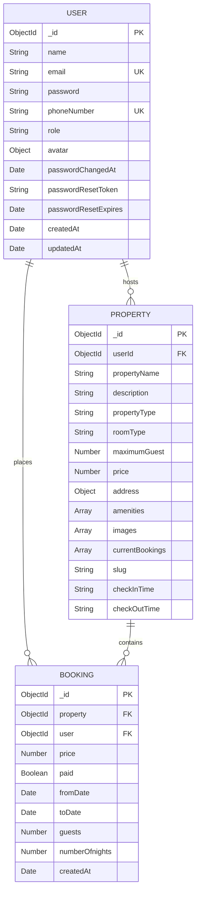

# HomelyHub — AI-Powered Stay Booking & Listing Management Platform

[](LICENSE)
[](https://nodejs.org/)
[](https://expressjs.com/)
[](https://react.dev/)
[](https://vitejs.dev/)
[](https://www.mongodb.com/)
[](https://redux-toolkit.js.org/)
[](https://vercel.com/)
[](https://render.com/)

HomelyHub is a full-stack MERN (MongoDB, Express, React, Node.js) web application designed for stay bookings, rental listing management, and AI-assisted travel planning. The platform enables property owners to host accommodations with automated AI descriptions, while providing users with real-time stay availability, robust search/filtering, seamless booking flows, and day-by-day trip itineraries generated by Large Language Models.

---

## Table of Contents

- [Overview](#overview)
- [Key Features](#key-features)
- [Application Workflow](#application-workflow)
- [System Architecture](#system-architecture)
- [Technology Stack](#technology-stack)
- [Project Structure](#project-structure)
- [Frontend Architecture](#frontend-architecture)
- [Backend Architecture](#backend-architecture)
- [API Overview](#api-overview)
  - [Authentication & User Profile Endpoints](#1-authentication--user-profile-endpoints-apiv1rentuser)
  - [Property Listings & Search Endpoints](#2-property-listings--search-endpoints-apiv1rentlisting)
  - [Booking & Order Endpoints](#3-booking--order-endpoints-apiv1rentuserbooking)
  - [AI Trip Planner Endpoints](#4-ai-trip-planner-endpoints-apiv1renttrip)
- [Authentication & Session Flow](#authentication--session-flow)
- [Database & Data Model Overview](#database--data-model-overview)
- [Environment Variables](#environment-variables)
- [Local Development Setup](#local-development-setup)
- [Running the Application](#running-the-application)
- [Production & Deployment Architecture](#production--deployment-architecture)
  - [Vercel & Render Relationship](#vercel--render-relationship)
  - [CORS & Credential Handling](#cors--credential-handling)
- [Security Considerations](#security-considerations)
- [Future Improvements](#future-improvements)
- [Contributing](#contributing)
- [License](#license)
- [Author & Contact](#author--contact)

---

## Overview

HomelyHub delivers an end-to-end marketplace experience connecting travelers with stay accommodations. Built with a decoupled frontend/backend architecture, the application integrates AI services for dynamic content creation and trip planning, alongside cloud image storage for property asset management.

### Primary Objectives:
1. **Seamless Search & Discovery**: Filter stays by geographic location, room type, property type, price ranges, guest capacity, amenities, and real-time date availability.
2. **Automated Host Onboarding**: Allow host owners to list properties by uploading image assets to cloud storage (ImageKit) and generating descriptions automatically via LLM integration (Groq SDK).
3. **Double-Booking Prevention**: Enforce reservation date overlap checks directly on property models during booking confirmation.
4. **AI-Driven Itinerary Planning**: Synthesize destination details, budgets, trip duration, and user interests into day-by-day travel itineraries mapped against available platform listings.

---

## Key Features

| Domain | Capability & Description |
| :--- | :--- |
| **Authentication & Profile** | User signup, login, and logout using JWT tokens stored in HTTP-Only cookies. Profile retrieval and password updates. |
| **Password Recovery** | SHA-256 hashed password reset tokens sent via Nodemailer & Mailgen with a 10-minute expiration limit. |
| **Listing Search & Filtering** | Multi-attribute search (city, state, price range, property type, room type, amenities, guest capacity) with pagination support (12 items/page). |
| **Availability Validation** | Search queries automatically exclude properties with active bookings overlapping the selected check-in/check-out dates. |
| **Property Management** | Property creation interface supporting multi-image cloud uploads to ImageKit (`property_images` folder) and user-scoped property retrieval. |
| **AI Content Generation** | Groq SDK integration (`llama-3.3-70b-versatile`) for drafting property descriptions from amenity tags and property specs. |
| **AI Trip Planner** | Intelligent trip generation returning structured day-wise plans alongside budget-matched property listings from the database. |
| **Booking Engine** | Order generation and payment verification workflow that blocks reserved date ranges on property records upon completion. |

---

## Application Workflow



---

## System Architecture

```text
                               +-----------------------------+
                               |         User Browser        |
                               +--------------+--------------+
                                              |
                                              | HTTPS / Web Requests
                                              v
                              +---------------+---------------+
                              |   Vercel Hosted Frontend      |
                              |   (React 18 + Redux + Vite)   |
                              +---------------+---------------+
                                              |
                                              | REST API (Credentials/Cookies)
                                              v
                              +---------------+---------------+
                              |    Render Hosted Backend      |
                              |    (Express.js + Node.js)     |
                              +-------+-------+-------+-------+
                                      |       |       |
           +--------------------------+       |       +--------------------------+
           |                                  |                                  |
           v                                  v                                  v
+----------+----------+            +----------+----------+            +----------+----------+
|    MongoDB Atlas    |            |   ImageKit Cloud    |            |     Groq AI SDK     |
| (User/Property/Book)|            |  (Asset Hosting)    |            |  (LLM Engine/Trip)  |
+---------------------+            +---------------------+            +---------------------+
```

---

## Technology Stack

### Frontend Architecture
- **Core Library**: React 18 (`react` `v18.2.0`, `react-dom` `v18.2.0`)
- **Build Tool**: Vite 6 (`vite` `v6.3.5`)
- **State Management**: Redux Toolkit (`@reduxjs/toolkit` `v2.8.2`, `react-redux` `v9.1.2`)
- **Routing**: React Router DOM (`react-router-dom` `v6.26.1`)
- **HTTP Client**: Axios (`axios` `v1.10.0`) with `qs` (`v6.14.0`) parameter serialization
- **UI Components & Styling**: Ant Design (`antd` `v5.26.1`), GSAP (`gsap` `v3.13.0`), Lucide Icons (`lucide-react` `v0.525.0`)
- **Maps**: Leaflet (`leaflet` `v1.9.4`) & React Leaflet (`react-leaflet` `v4.2.1`)
- **Form & Inputs**: TanStack Form (`@tanstack/react-form` `v1.12.3`), React Datepicker (`react-datepicker` `v8.4.0`), React Input Range (`react-input-range` `v1.3.0`)
- **Notifications**: React Hot Toast (`react-hot-toast` `v2.5.2`)

### Backend Architecture
- **Runtime Environment**: Node.js (ES Modules, `"type": "module"`)
- **Web Framework**: Express (`express` `v4.19.2`)
- **Database Engine**: MongoDB via Mongoose (`mongoose` `v8.5.1`)
- **Authentication**: JSON Web Tokens (`jsonwebtoken` `v9.0.2`), `bcrypt` (`v5.1.1`), `cookie-parser` (`v1.4.6`)
- **Security & CORS**: Express CORS (`cors` `v2.8.5`)
- **Media Management**: ImageKit SDK (`imagekit` `v5.2.0`)
- **AI Integrations**: Groq SDK (`groq-sdk` `v0.7.0`) using model `llama-3.3-70b-versatile`
- **Email Notifications**: Nodemailer (`nodemailer` `v6.9.14`) & Mailgen (`mailgen` `v2.0.28`)
- **Data Validation & Formatting**: `validator` (`v13.12.0`), `slugify` (`v1.6.6`)

---

## Project Structure

```text
HomelyHub/
├── LICENSE
├── README.md
├── database/
│   └── properties.seed.json             # 31 pre-configured sample property datasets
├── docs/
│   └── HomelyHub_Project_Presentation.pdf # Presentation & architecture documentation
├── backend/
│   ├── .env.example                     # Environment template for backend service
│   ├── package.json                     # Backend dependencies & script definitions
│   ├── package-lock.json
│   └── src/
│       ├── index.js                     # Server entry point & CORS configuration
│       ├── Models/                      # Mongoose data schemas
│       │   ├── bookingModel.js          # Reservation records & pre-find populates
│       │   ├── propertyModel.js         # Stay listings & date reservation locks
│       │   └── userModel.js             # User accounts, auth hooks & password reset
│       ├── controllers/                 # Route logic controllers
│       │   ├── authController.js        # Auth, JWT, session, password management
│       │   ├── bookingController.js     # Order creation & payment verification
│       │   ├── propertyController.js    # Listing CRUD & ImageKit upload handler
│       │   └── tripController.js        # AI trip generator & description writer
│       ├── routes/                      # Express route specifications
│       │   ├── bookingRouter.js         # /api/v1/rent/user/booking routes
│       │   ├── propertyRouter.js        # /api/v1/rent/listing routes
│       │   ├── tripRouter.js            # /api/v1/rent/trip routes
│       │   └── userRoutes.js            # /api/v1/rent/user routes
│       ├── ai/                          # Groq SDK integrations
│       │   ├── aiClient.js              # Groq client instantiation
│       │   ├── generateDescription.js   # Host property description prompt engine
│       │   └── tripPlanner.js           # Day-wise itinerary planner engine
│       └── utils/                       # Shared server utilities
│           ├── APIFeatures.js           # Search, filter, and pagination engine
│           ├── ImagekitIO.js            # ImageKit cloud storage client
│           ├── db.js                    # MongoDB Atlas connection handler
│           ├── mail.js                  # Nodemailer & Mailgen mail transporter
│           └── token.js                 # JWT issuance, cookies & object filtering
└── frontend/
    ├── .env                             # Frontend environment configuration
    ├── index.html                       # HTML5 entry document
    ├── package.json                     # Frontend dependencies & scripts
    ├── package-lock.json
    ├── vite.config.js                   # Vite configuration & dev proxy rules
    ├── eslint.config.js                 # ESLint rules configuration
    ├── public/                          # Static public assets (images, logos)
    └── src/
        ├── App.jsx                      # Main application component & routes
        ├── main.jsx                     # React root DOM rendering script
        ├── components/                  # UI components organized by module
        │   ├── accomodation/            # Accommodations list & host listing forms
        │   ├── aiTripPlanner/           # AI itinerary planner form & view
        │   ├── home/                    # Search, hero, & property showcase
        │   ├── myBookings/              # Booking management UI
        │   ├── payment/                 # Payment modal & confirmation UI
        │   ├── propertyListing/         # Property detail & gallery components
        │   └── user/                    # Auth modals & profile forms
        ├── store/                       # Redux Toolkit store & feature slices
        │   ├── store.js                 # Redux store config
        │   ├── accomodationSlice.js
        │   ├── bookingSlice.js
        │   ├── paymentSlice.js
        │   ├── propertyDetailsSlice.js
        │   ├── propertySlice.js
        │   └── userSlice.js
        ├── ai/                          # AI service dispatchers
        ├── css/                         # Custom application styling
        └── utils/
            └── axios.js                 # Centralized Axios instance configuration
```

---

## Frontend Architecture

The frontend is implemented with React 18 and bundled using Vite. Application state is centrally managed with Redux Toolkit slices handling distinct domains:

1. **Centralized HTTP Client (`src/utils/axios.js`)**:
   All server communications use a custom Axios instance configured with credential forwarding and custom array parameter serialization.

   ```javascript
   import axios from 'axios';
   import qs from 'qs';

   export const axiosInstance = axios.create({
       baseURL: import.meta.env.VITE_API_URL || 'https://homelyhubinternshipbatch8-ycne.onrender.com/api',
       withCredentials: true,
       paramsSerializer: params => qs.stringify(params, { arrayFormat: 'repeat' }),
   });
   ```

2. **State Management**:
   - `userSlice`: Handles authentication status, user session details, and profile updates.
   - `propertySlice`: Controls listing collection states, active filters, search criteria, and pagination.
   - `propertyDetailsSlice`: Manages single property views, photo gallery states, and map coordinates.
   - `bookingSlice` & `paymentSlice`: Coordinates checkout flows, order initialization, and booking history.

---

## Backend Architecture

The backend follows an Express.js MVC pattern using ES Modules (`"type": "module"`).

### Core Components:

1. **`APIFeatures` Query Engine (`src/utils/APIFeatures.js`)**:
   Encapsulates complex database queries to perform multi-field filtering, availability checks, keyword searching, and pagination:
   - `filter()`: Parses MongoDB operator conditions (`gte`, `gt`, `lte`, `lt`), filtering by room types, amenities, and price.
   - `search()`: Executes regex search across `propertyName`, `description`, `address.city`, `address.state`, and `address.area`. Filters out properties whose `currentBookings` overlap requested check-in/check-out dates.
   - `paginate()`: Applies default page offsets (defaulting to 12 items per page).

2. **AI Modules (`src/ai/`)**:
   - `aiClient.js`: Initializes `Groq` instance using `process.env.GROQ_API_KEY`.
   - `generateDescription.js`: Constructs system/user prompts requesting JSON-formatted descriptions tailored to property features.
   - `tripPlanner.js`: Generates structured day-wise trip schedules based on destination, total budget, duration, guest count, and specific interests.

3. **Cloud Asset Upload (`src/utils/ImagekitIO.js`)**:
   Property photos uploaded during host accommodation setup are pushed directly to ImageKit, returning accessible URLs and file IDs. Base64 strings/files are never directly persisted in MongoDB.

---

## API Overview

Base URL Path: `/api/v1/rent`

### 1. Authentication & User Profile Endpoints (`/api/v1/rent/user`)

| Method | Endpoint | Auth Required | Purpose | Body / Parameters | Response Summary |
| :--- | :--- | :---: | :--- | :--- | :--- |
| `POST` | `/signup` | No | Register new user account | `{ name, email, password, passwordConfirm, phoneNumber, avatar }` | User record + sets JWT cookie |
| `POST` | `/login` | No | Authenticate existing user | `{ email, password }` | User record + sets JWT cookie |
| `GET` | `/logout` | No | Terminate user session | None | Clears JWT cookie (`jwt=loggedout`) |
| `GET` | `/me` | **Yes** | Get current user profile | None | Logged-in User profile object |
| `PATCH` | `/updateMe` | **Yes** | Update profile details | `{ name, phoneNumber, avatar }` | Updated User record |
| `PATCH` | `/updateMyPassword` | **Yes** | Change current password | `{ passwordCurrent, password, passwordConfirm }` | User record + updated JWT cookie |
| `POST` | `/forgotPassword` | No | Trigger password reset email | `{ email }` | Success status message |
| `PATCH` | `/resetPassword/:token` | No | Reset password via token | Path param: `token`, Body: `{ password, passwordConfirm }` | User record + updated JWT cookie |
| `POST` | `/generateDescription` | **Yes** | Generate AI property description | `{ propertyName, propertyType, roomType, amenities, address }` | `{ status: "success", data: { description } }` |
| `POST` | `/newAccommodation` | **Yes** | Create new host listing | `{ propertyName, description, propertyType, roomType, price, address, amenities, images, ... }` | Newly created Property record |
| `GET` | `/myAccommodation` | **Yes** | Get listings created by current host | None | Array of host Property records |

### 2. Property Listings & Search Endpoints (`/api/v1/rent/listing`)

| Method | Endpoint | Auth Required | Purpose | Query Parameters | Response Summary |
| :--- | :--- | :---: | :--- | :--- | :--- |
| `GET` | `/` | No | Search, filter, and paginate stays | `search`, `city`, `price[gte]`, `price[lte]`, `propertyType`, `roomType`, `amenities`, `checkIn`, `checkOut`, `guests`, `page` | `{ status: "success", no_of_responses, data: [...] }` |
| `GET` | `/:id` | No | Retrieve single stay details | Path param: `id` | `{ status: "success", data: PropertyObject }` |

### 3. Booking & Order Endpoints (`/api/v1/rent/user/booking`)

| Method | Endpoint | Auth Required | Purpose | Body / Parameters | Response Summary |
| :--- | :--- | :---: | :--- | :--- | :--- |
| `GET` | `/` | **Yes** | Fetch all bookings for logged-in user | None | `{ status: "success", data: { bookings: [...] } }` |
| `GET` | `/:bookingId` | **Yes** | Fetch details of a specific booking | Path param: `bookingId` | `{ status: "success", data: { bookings: BookingObject } }` |
| `POST` | `/create-order` | **Yes** | Initialize payment order | `{ amount, propertyId, fromDate, toDate, guests }` | `{ success: true, orderId, amount, propertyId, ... }` |
| `POST` | `/verify-payment` | **Yes** | Confirm payment & lock booking dates | `{ orderId, forceStatus: "success", bookingDetails: { propertyId, price, fromDate, toDate, guests, nights } }` | `{ success: true, booking, paymentId }` |

### 4. AI Trip Planner Endpoints (`/api/v1/rent/trip`)

| Method | Endpoint | Auth Required | Purpose | Body Parameters | Response Summary |
| :--- | :--- | :---: | :--- | :--- | :--- |
| `POST` | `/` | No | Generate day-wise trip plan & matching stays | `{ destination, budget, days, people, interests }` | `{ status: "success", data: { plan, properties, perNight } }` |

---

## Authentication & Session Flow

HomelyHub implements token-based authentication using JSON Web Tokens (JWT) combined with HTTP-Only cookies to protect against Cross-Site Scripting (XSS).

```mermaid
stateDiagram-v2
    [*] --> Unauthenticated
    Unauthenticated --> SignupSubmitted: POST /api/v1/rent/user/signup
    Unauthenticated --> LoginSubmitted: POST /api/v1/rent/user/login
    
    SignupSubmitted --> CookieIssued: Valid Credentials & Passwords Match
    LoginSubmitted --> CookieIssued: Valid Email & Hash Comparison (bcrypt)
    
    CookieIssued --> AuthenticatedSession: Set-Cookie: jwt=<token>; HttpOnly; SameSite
    
    AuthenticatedSession --> AuthenticatedSession: API Requests with Credentials
    AuthenticatedSession --> PasswordChanged: PATCH /api/v1/rent/user/updateMyPassword
    PasswordChanged --> CookieIssued: Issue New Token with updated passwordChangedAt
    
    AuthenticatedSession --> ResetRequested: POST /api/v1/rent/user/forgotPassword
    ResetRequested --> EmailSent: Send SHA-256 Token via Nodemailer (10 min expiry)
    EmailSent --> CookieIssued: PATCH /api/v1/rent/user/resetPassword/:token
    
    AuthenticatedSession --> Unauthenticated: GET /api/v1/rent/user/logout (Cookie cleared)
```



### Authentication Lifecycle Details:
1. **Password Hashing**: User passwords are encrypted prior to persistence using `bcrypt` with a cost factor of `12`. Passwords are excluded from database query projections (`select: false`).
2. **Token Generation**: Upon successful login or signup, `jwt.sign()` generates a signed JWT containing the user's database ID (`_id`).
3. **Cookie Attributes**:
   - `httpOnly: true`: Prevents client-side script access to session tokens.
   - `sameSite`: Configured to `"none"` in production environments to support cross-origin subdomains, and `"lax"` in development.
   - `secure`: Set to `true` in production (mandating HTTPS).
4. **Invalidation on Password Change**: Token verification checks if `passwordChangedAt` timestamp succeeds token issuance timestamp (`iat`). If true, the token is invalidated.

---

## Database & Data Model Overview

Database entities are modeled via Mongoose schemas adhering to structured constraints:



### Schema Rules & Hooks:
- **`User Schema`**: `email` validation via `validator.isEmail`. `password` selection disabled by default (`select: false`). Automatic removal of sensitive fields during JSON transformations (`toJSON`).
- **`Property Schema`**: Requires at least 6 image objects in `images` array. Pre-save hook generates lowercased URL slugs (`slugify`) and sanitizes city strings.
- **`Booking Schema`**: Pre-find hook auto-populates `user` and `property` details (selecting `maximumGuest`, `images`, `propertyName`, `address`).

---

## Environment Variables

### Backend Configuration (`backend/.env.example`)

Create a `backend/.env` file based on the following environment definitions:

```env
# ---------- Server Configuration ----------
PORT=8080
NODE_ENV=development
CLIENT_URL=http://localhost:5173
ORIGIN_ACCESS_URL=http://localhost:5173

# ---------- Database Connection ----------
MONGO_URI=mongodb+srv://<user>:<password>@<cluster>.mongodb.net/homelyhub

# ---------- Authentication ----------
JWT_SECRET=your_super_secret_jwt_key_string
JWT_EXPIRES_IN=7d
JWT_COOKIE_EXPIRES_IN=7

# ---------- Email Service (Mailtrap) ----------
MAILTRAP_SMTP_HOST=sandbox.smtp.mailtrap.io
MAILTRAP_SMTP_USER=your_mailtrap_user_id
MAILTRAP_SMTP_PASS=your_mailtrap_password

# ---------- ImageKit Cloud Storage ----------
IMAGEKIT_PUBLICKEY=public_xxxxxxxxxxxx
IMAGEKIT_PRIVATEKEY=private_xxxxxxxxxxxx
IMAGEKIT_URLENDPOINT=https://ik.imagekit.io/your_imagekit_id

# ---------- Groq AI SDK ----------
GROQ_API_KEY=gsk_xxxxxxxxxxxxxxxxxxxx
```

### Frontend Configuration (`frontend/.env`)

Create a `frontend/.env` file with the following variable:

```env
# Set to backend API path. Defaults to /api during development proxying
VITE_API_URL=http://localhost:8080/api
```

---

## Local Development Setup

### Prerequisites
- **Node.js**: Version `18.0.0` or higher
- **npm**: Version `9.0.0` or higher
- **MongoDB**: Active MongoDB Atlas cluster URI or local MongoDB instance

---

### Step 1: Clone the Repository

```bash
git clone https://github.com/Gagan3287/HomelyHub.git
cd HomelyHub
```

---

### Step 2: Backend Setup

```bash
cd backend
npm install
cp .env.example .env
```

Edit `backend/.env` with your actual MongoDB URI, JWT secret, ImageKit keys, Groq API key, and Mailtrap credentials.

Run the backend development server:

```bash
npm run dev
```

The API server will listen on `http://localhost:8080`.

---

### Step 3: Frontend Setup

Open a new terminal window:

```bash
cd frontend
npm install
npm run dev
```

The Vite dev server will start at `http://localhost:5173`. Requests made to `/api` will be proxied automatically to the backend server.

---

### Step 4: Seed Sample Property Data (Optional)

To populate your database with the 31 sample property listings included in `database/properties.seed.json`:

```bash
mongoimport --uri "<YOUR_MONGO_URI>" \
  --collection properties \
  --jsonArray \
  --file database/properties.seed.json
```

---

## Running the Application

### Development Scripts Summary

| Workspace | Script | Command | Purpose |
| :--- | :--- | :--- | :--- |
| `backend/` | `npm run dev` | `nodemon src/index.js` | Starts API server with hot reloading |
| `backend/` | `npm start` | `node src/index.js` | Runs API server in production mode |
| `frontend/` | `npm run dev` | `vite` | Starts local development server |
| `frontend/` | `npm run build` | `vite build` | Compiles production assets to `dist/` |
| `frontend/` | `npm run preview`| `vite preview` | Previews production build locally |

---

## Production & Deployment Architecture

HomelyHub is configured for separate frontend and backend cloud hosting platforms:

```text
+-----------------------------------+             +-----------------------------------+
|          Vercel Platform          |             |          Render Platform          |
|                                   |             |                                   |
|   Frontend Deployment             |  REST API   |   Backend Express Service         |
|   https://homelyhub.vercel.app    +------------>+   https://...onrender.com         |
|                                   | Credentials |                                   |
+-----------------------------------+             +-----------------------------------+
```

### Vercel & Render Relationship
1. **Frontend Hosting (Vercel)**: The React single-page application is deployed as static assets on Vercel's global CDN.
2. **Backend Hosting (Render)**: The Express Node.js API service runs on Render (`https://homelyhubinternshipbatch8-ycne.onrender.com`).
3. **Routing Resolution**: Production requests to `/api` resolve directly to the Render backend service host specified by `VITE_API_URL`.

### CORS & Credential Handling
Because the frontend (`Vercel`) and backend (`Render`) operate on different domain origins, cross-origin requests require explicit credential configuration:

1. **Backend CORS Settings (`src/index.js`)**:
   ```javascript
   app.use(
     cors({
       origin: process.env.CLIENT_URL || "http://localhost:5173",
       credentials: true,
     })
   );
   ```

2. **Frontend Axios Client Configuration**:
   ```javascript
   export const axiosInstance = axios.create({
     baseURL: import.meta.env.VITE_API_URL || 'https://homelyhubinternshipbatch8-ycne.onrender.com/api',
     withCredentials: true,
   });
   ```

3. **Cookie SameSite and Secure Flags (`src/utils/token.js`)**:
   In production (`NODE_ENV=production`), cookie settings are configured with `sameSite: "none"` and `secure: true` to allow cookies to cross origins over HTTPS.

---

## Security Considerations

1. **XSS Protection**: JWT tokens are transmitted inside `httpOnly` cookies, preventing client-side JavaScript execution scripts from accessing tokens.
2. **Password Storage**: Passwords are hashed using `bcrypt` before storage. Plaintext passwords are never logged or stored.
3. **Parameter Filtering**: The `filterObj` helper utility filters request body input during profile updates to prevent unauthorized field mutation (e.g., self-elevating privileges to `admin`).
4. **Token Invalidation**: Updating account credentials invalidates previously issued JWT tokens via `passwordChangedAt` checking logic.
5. **Secure Reset Tokens**: Password reset tokens emailed to users are stored in the database as SHA-256 hashes (`crypto.createHash('sha256')`) with explicit 10-minute expiration windows.

---

## Future Improvements

- **Payment Gateway Integration**: Upgrade mock checkout handlers to full production Razorpay / Stripe webhooks.
- **Review & Rating Subsystem**: Allow verified guests to leave ratings and textual feedback for completed stay bookings.
- **Host Dashboard Analytics**: Provide hosts with visual revenue charts, booking occupancy metrics, and seasonal price management tools.
- **WebSockets / Real-time Messaging**: Introduce live chat features connecting prospective guests directly with property hosts.

---

## Contributing

Contributions, bug reports, and feature requests are welcome!

1. Fork the repository
2. Create a feature branch (`git checkout -b feature/AmazingFeature`)
3. Commit your changes (`git commit -m 'Add some AmazingFeature'`)
4. Push to the branch (`git push origin feature/AmazingFeature`)
5. Open a Pull Request

---

## License

This project is licensed under the Apache License 2.0 - see the [LICENSE](LICENSE) file for details.

```text
Licensed under the Apache License, Version 2.0 (the "License");
you may not use this file except in compliance with the License.
You may obtain a copy of the License at

    http://www.apache.org/licenses/LICENSE-2.0

Unless required by applicable law or agreed to in writing, software
distributed under the License is distributed on an "AS IS" BASIS,
WITHOUT WARRANTIES OR CONDITIONS OF ANY KIND, either express or implied.
See the License for the specific language governing permissions and
limitations under the License.
```

---

## Author & Contact

**Gagan Chandra Tej Vengala**
- **Institution**: SR University
- **Program**: MERN Stack Development Internship (Cohort WMSI26_008)
- **Organization**: Emertxe / WebStack Academy (WSA)
- **GitHub**: [@Gagan3287](https://github.com/Gagan3287)
